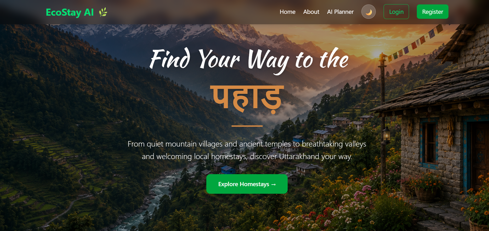
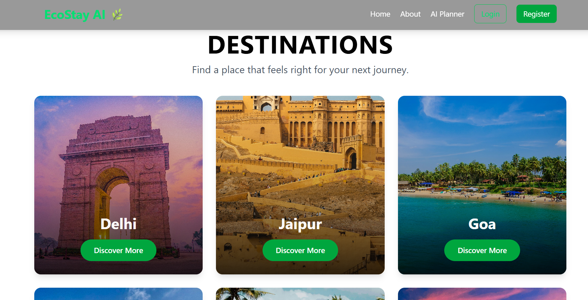
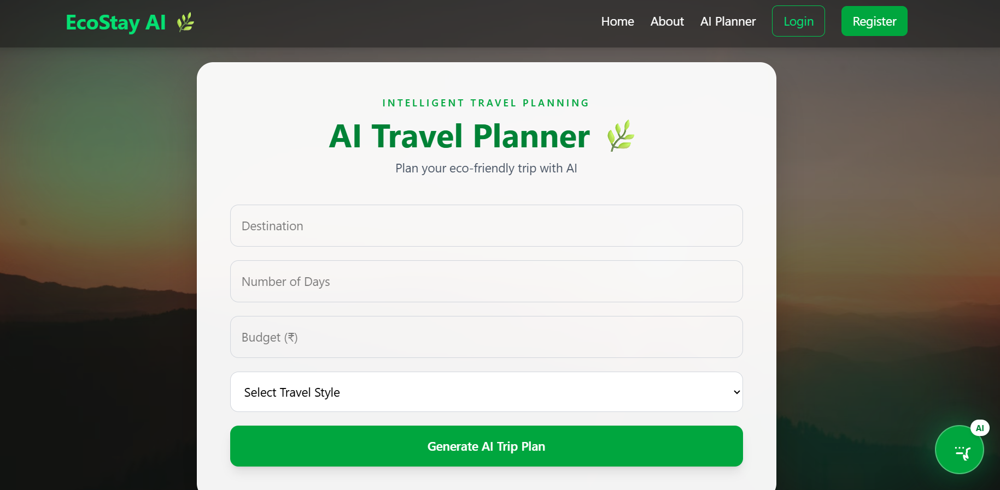
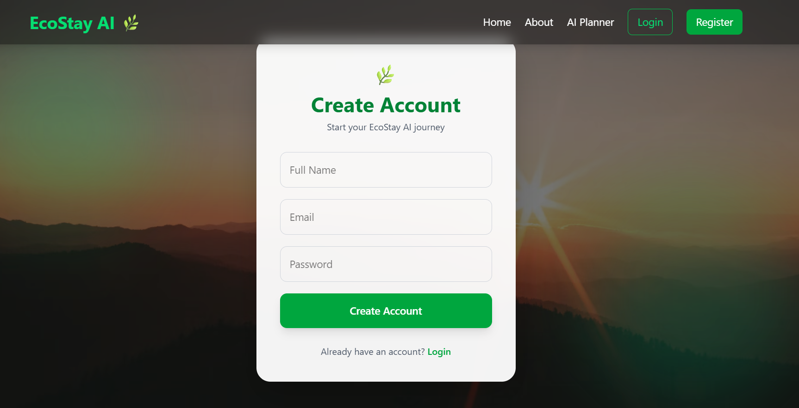

# 🌿 EcoStay AI

## AI-Powered Homestay & Eco-Tourism Platform

EcoStay AI is a full-stack web application designed to make travel across Uttarakhand more convenient, personalized, and locally focused. The platform combines **homestay discovery, district-wise tourism exploration, secure authentication, booking functionality, and an AI-powered travel planner** in one application.

The project was developed as part of the **AI-Assisted Full Stack Web Development Internship** at TBI, Graphic Era Hill University.

---

## 🌐 Live Project

| Resource | Link |
|---|---|
| 🌐 **Frontend** | https://eco-stay-hast00ctg-tech-titans-138c.vercel.app/ |
| ⚙️ **Backend API** | https://ecostay-ai-3io2.onrender.com |
| 💻 **GitHub Repository** | https://github.com/sakshii0555/EcoStay-AI |

---

## 🎯 Problem Statement

Tourists often need to use multiple platforms to discover destinations, find local stays, and plan their trips. Information about local attractions can also be scattered across different sources, while generic travel plans may not match a traveller's budget, duration, or interests.

EcoStay AI addresses this by bringing these activities together into a single platform focused on **Uttarakhand's tourism and local homestay experience**.

---

## 💡 Objectives

- Provide a centralized platform for exploring Uttarakhand.
- Showcase tourist attractions across the state's districts.
- Help users discover and manage homestay information.
- Provide secure user registration and authentication.
- Allow users to book homestays through the platform.
- Generate personalized travel plans using Google Gemini.
- Encourage local and responsible tourism.

---

## ✨ Key Features

### 🏔️ Uttarakhand Tourism Exploration

Users can explore destinations and tourist attractions across the **13 districts of Uttarakhand**, including information and visuals for different destinations.

### 🏡 Homestay Discovery

The platform provides homestay listings containing information such as:

- Homestay name
- Location
- District
- Price
- Rating
- Description
- Images

Users can retrieve homestays generally or filter them by district.

### 📅 Homestay Booking

Authenticated users can create bookings for available homestays. Booking information is connected with the relevant user and homestay data.

### 🔐 Authentication & Authorization

EcoStay AI supports:

- User registration
- User login
- JWT-based authentication
- Password hashing using bcrypt.js
- Google OAuth using Passport.js
- Protected user actions and routes

### 🤖 AI Travel Planner

The AI Travel Planner uses the **Google Gemini API with Gemini 2.5 Flash** to generate personalized travel plans.

Users provide details such as:

- Destination
- Number of days
- Budget
- Travel style

The backend sends the structured request to Gemini and returns a personalized itinerary to the frontend.

### 📱 Responsive Interface

The frontend is built using React and Tailwind CSS to provide a responsive interface for exploration, authentication, homestays, bookings, and AI-powered travel planning.

---

## 🧠 AI Travel Planner Workflow

```text
User Preferences
      │
      ▼
React Frontend
      │
      ▼
Express.js Backend
      │
      ▼
Gemini 2.5 Flash
      │
      ▼
Personalized Travel Itinerary
      │
      ▼
React Frontend
```

The AI planner separates user interaction from AI processing: the frontend collects the preferences, the backend prepares the request, Gemini generates the itinerary, and the result is displayed to the user.

---

## 🏗️ System Architecture

```text
                    ┌─────────────────────┐
                    │       User          │
                    └──────────┬──────────┘
                               │
                               ▼
                    ┌─────────────────────┐
                    │ React.js Frontend   │
                    │ Vite + Tailwind CSS │
                    └──────────┬──────────┘
                               │ REST API
                               ▼
                    ┌─────────────────────┐
                    │ Node.js + Express   │
                    │ Backend             │
                    └──────┬────────┬─────┘
                           │        │
              ┌────────────┘        └─────────────┐
              ▼                                    ▼
    ┌──────────────────┐                 ┌──────────────────┐
    │ MongoDB Atlas    │                 │ Google Gemini API│
    │ + Mongoose       │                 │ Gemini 2.5 Flash │
    └──────────────────┘                 └──────────────────┘
```

---

## 🛠️ Technology Stack

### Frontend

- React.js
- Vite
- Tailwind CSS
- React Router DOM

### Backend

- Node.js
- Express.js
- REST APIs

### Database

- MongoDB Atlas
- Mongoose

### Authentication

- JWT
- bcrypt.js
- Passport.js
- Google OAuth

### Artificial Intelligence

- Google Gemini API
- Gemini 2.5 Flash

### Deployment

- Vercel — Frontend
- Render — Backend

---

## 📁 Project Structure

```text
EcoStay-AI/
│
├── assets/
│
├── backend/
│   ├── controllers/
│   ├── models/
│   ├── routes/
│   ├── middleware/
│   └── server.js
│
├── frontend/
│   ├── public/
│   └── src/
│       ├── components/
│       ├── pages/
│       ├── assets/
│       └── App.jsx
│
├── ecostay-ai/
│
├── screenshots/
│   ├── AIPlanner.png
│   ├── Register.png
│   ├── destination.png
│   └── home.png
│
├── .gitignore
├── PROMPTS.md
└── README.md
```

---

## 📸 Screenshots

### 🏠 Home Page



### 🗺️ Destination Exploration



### 🤖 AI Travel Planner



### 🔐 Registration



---

## 🔌 Important API Endpoints

### Authentication

| Method | Endpoint | Purpose |
|---|---|---|
| POST | `/api/auth/register` | Register a new user |
| POST | `/api/auth/login` | Login an existing user |

### Homestays

| Method | Endpoint | Purpose |
|---|---|---|
| GET | `/api/homestays` | Fetch available homestays |
| GET | `/api/homestays/district/:district` | Fetch homestays for a district |
| POST | `/api/homestays` | Create a homestay |
| PUT | `/api/homestays/:id` | Update a homestay |
| DELETE | `/api/homestays/:id` | Delete a homestay |

### AI Travel Planner

| Method | Endpoint | Purpose |
|---|---|---|
| POST | `/api/ai/plan` | Generate a personalized travel itinerary |

### Bookings

| Method | Endpoint | Purpose |
|---|---|---|
| POST | `/api/bookings` | Create an authenticated homestay booking |

---

## ⚙️ Local Installation

### 1. Clone the repository

```bash
git clone https://github.com/sakshii0555/EcoStay-AI.git
cd EcoStay-AI
```

### 2. Frontend Setup

```bash
cd frontend
npm install
npm run dev
```

The Vite development server will start locally.

### 3. Backend Setup

Open another terminal:

```bash
cd backend
npm install
npm start
```

The backend can then be accessed through the configured local server.

---

## 🔑 Environment Variables

Create a `.env` file inside the backend directory.

Example:

```env
PORT=5000
MONGO_URI=your_mongodb_connection_string
JWT_SECRET=your_jwt_secret
GEMINI_API_KEY=your_gemini_api_key
GOOGLE_CLIENT_ID=your_google_client_id
GOOGLE_CLIENT_SECRET=your_google_client_secret
```

> **Important:** Never commit real API keys, passwords, database credentials, OAuth secrets, or `.env` files to GitHub.

---

## ☁️ Deployment

### Frontend

The React frontend is deployed on **Vercel**.

### Backend

The Node.js/Express backend is deployed on **Render**.

### Database

MongoDB Atlas is used as the cloud database.

### AI

The AI Travel Planner communicates with the Google Gemini API through the backend.

---

## ⚠️ Known Deployment Limitations

EcoStay AI currently uses free-tier deployment services.

### Render Backend

The backend may spin down after inactivity on a free instance. Consequently, the first request after a period of inactivity may take longer while the service starts.

### Vercel Frontend

The frontend is subject to the limits of the selected Vercel plan.

### Gemini API

The AI Travel Planner depends on the availability, quota, and usage limits of the Google Gemini API.

---

## 🔒 Security Considerations

- Passwords are hashed before storage.
- JWT is used for authenticated sessions.
- Protected routes restrict authorized actions.
- Google OAuth is handled through Passport.js.
- Environment variables are used for sensitive configuration.
- Secret credentials should remain outside version control.

---

## 🚀 Future Scope

Possible future improvements include:

- Online payment integration
- Advanced homestay search and filtering
- Interactive maps and route planning
- Reviews and user ratings
- Weather information
- Multilingual support
- AI chatbot for travel assistance
- Carbon-footprint and sustainability tracking
- More advanced recommendation systems

---

## 👩‍💻 Developer

**Sakshi Rawat**

B.Tech Computer Science & Engineering  
Graphic Era Hill University, Dehradun

**Internship:** AI-Assisted Full Stack Web Development  
**Intern ID:** TBI-26100581

---

## 📌 Project Summary

EcoStay AI combines **full-stack web development, cloud deployment, authentication, database management, and generative AI** to create a practical eco-tourism platform.

The project demonstrates the complete development workflow from frontend design and REST API development to database integration, authentication, AI integration, testing, and deployment.

---

## 📄 Internship Project

**Project:** EcoStay AI – AI-Powered Homestay & Eco-Tourism Platform  
**Domain:** AI-Assisted Full Stack Web Development  
**Institution:** Graphic Era Hill University  
**Internship:** TBI Internship
