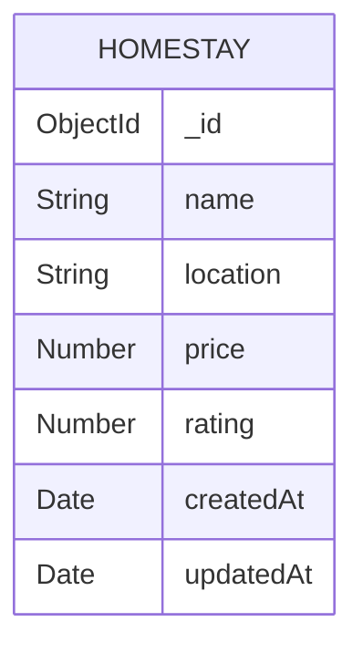

# 🌿 EcoStay AI

EcoStay AI is a MERN-based Homestay & Eco-Tourism platform that allows users to explore and manage eco-friendly homestays.

---

## Tech Stack

### Frontend
- React.js
- Vite
- Tailwind CSS

### Backend
- Node.js
- Express.js

### Database
- MongoDB Atlas
- Mongoose

---

## Features

- View all homestays
- View homestay by ID
- Add a new homestay
- Update homestay
- Delete homestay
- Search homestays by location

---

## API Endpoints

| Method | Endpoint |
|---------|----------|
| GET | `/api/homestays` |
| GET | `/api/homestays/:id` |
| POST | `/api/homestays` |
| PUT | `/api/homestays/:id` |
| DELETE | `/api/homestays/:id` |
| GET | `/api/homestays/search?location=Shimla` |

---

## Database Choice

This project uses **MongoDB Atlas** because it is cloud-based, scalable, and integrates easily with Node.js using Mongoose.

---

## Database Schema



---

## Environment Variables

Create a `.env` file inside the **backend** folder.

```env
PORT=5000

DATABASE_URL=your_mongodb_connection_string
```

A sample configuration is available in:

```
backend/.env.example
```

---

## Backend Setup

```bash
cd backend
npm install
npm run dev
```

Server runs at:

```
http://localhost:5000
```

API Base URL:

```
http://localhost:5000/api/homestays
```

---

## Project Structure

```
backend/
├── config/
├── controllers/
├── middleware/
├── models/
├── routes/
├── server.js

ecostay-ai/
├── src/
├── public/
```

---

## Author

**Sakshi Rawat**  
B.Tech CSE  
Graphic Era Hill University